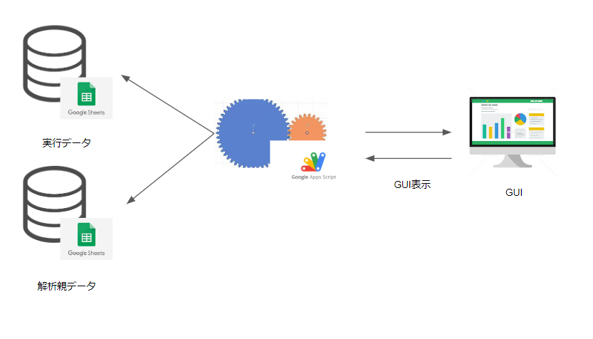

# 要件定義書

# 初めに
## 本書の目的
本書はGoogleスライドの分析および結果表示ツールにおけるWebアプリケーション要件を定義する。

 

## 用語定義

| 用語             | 説明                                                                                  |
| ---------------- | ------------------------------------------------------------------------------------- |
| GAS              | Google App Scriptのことを指す。Google社が提供するアプリケーション開発プラットフォーム |
| スプレッドシート | Google社が提供する表計算ソフトウェア                                                  |
| Link             | Nextgenにおける社内組織                                                               |
| パワーポイント   | Microsoft社が提供するプレゼンテーションソフトウェア                                   |
| スライド         | Google社が提供するプレゼンテーションソフトウェア                                      |

 

# 概要
## システム構成
本プロジェクトで構築予定のツール構成は以下の通り。GASおよびスプレッドシートを用いて、Webアプリケーションを構築する

 

## 機能一覧

| 機能名       | 機能説明                                                                                                                                                                 |
| ------------ | ------------------------------------------------------------------------------------------------------------------------------------------------------------------------ |
| スライド分析 | Linkで収集したパワーポイントおよびスライドの各データ（スライド枚数・文字数・発表時間）をもとに、スライドの分析をおこない発表時間およびスライドの内容を機械的に分析を行う |
| GUI表示      | スライド分析した結果をGUIで表示する                                                                                                                                      |

 

## 作成ドキュメント
本プロジェクトで作成予定ドキュメントを以下に示す。

| ドキュメント種別 | ファイル名                  | 備考                                                             |
| ---------------- | --------------------------- | ---------------------------------------------------------------- |
| 要件定義書       | GoogleSlideAnalytics_BRD.md | 本書                                                             |
| 基本設計書       | GoogleSlideAnalytics_DD.md  | 本要件に沿った基本設計書。GUI仕様について記載を行う |

 

## セキュリティ
本プロジェクトにおいて、セキュリティ機器を具備する機能は導入しない。  
ただし、Googleにおいての認証によって社外以外のアクセスを禁止するようにする。

 

# 変更履歴

| 版        | 日付       | 担当  | 変更内容      |
| --------- | ---------- | ----- | ------------- |
| ドラフトA | 2022/09/30 | NXG林 | ドラフトA初版 |
