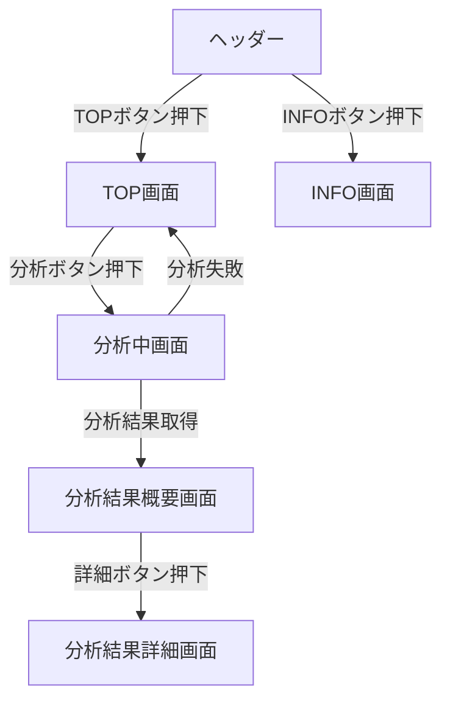
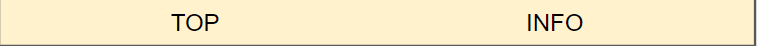
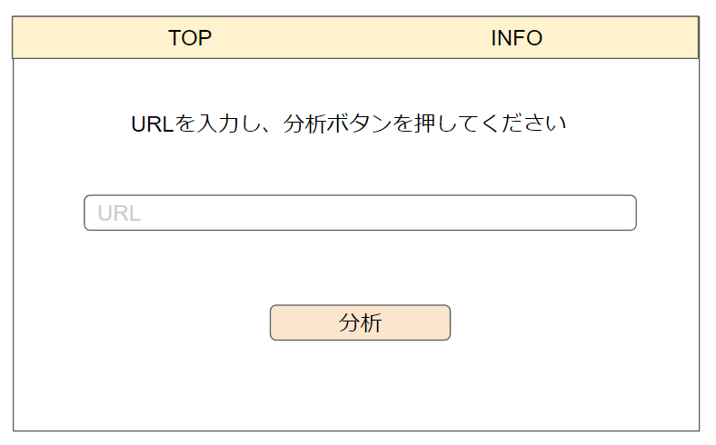
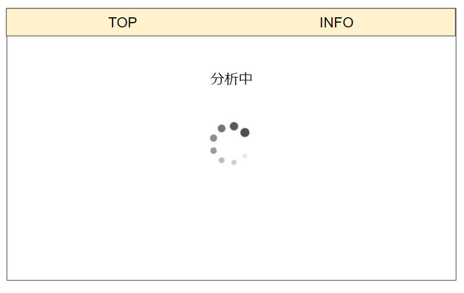
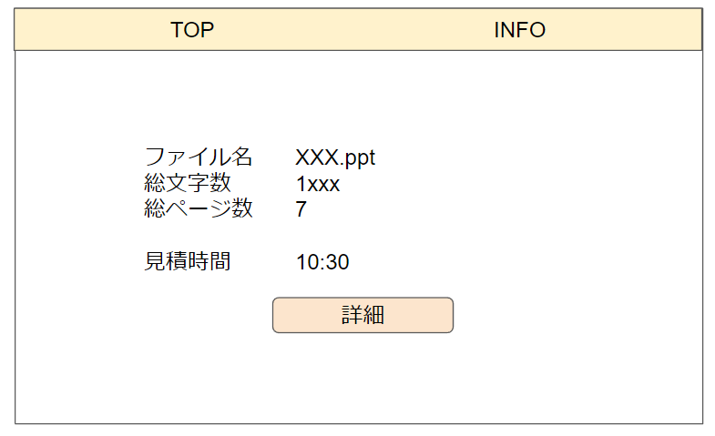
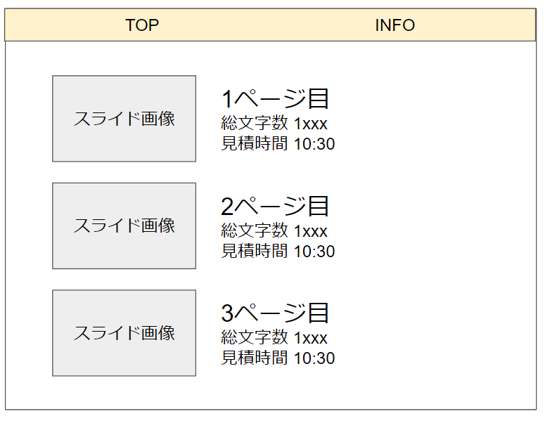
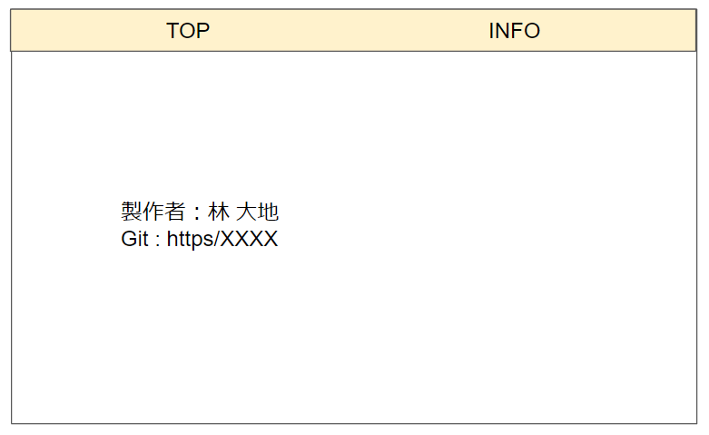

# 基本設計書

### 更新履歴

| 版        | 日付       | 担当  | 変更内容      |
| --------- | ---------- | ----- | ------------- |
| ドラフトA | 2022/09/30 | NXG林 | ドラフトA初版 |


## GUI基本設計

### ログ出力
Googleドキュメントにてログの保存をおこなう。
ログディレクトリは「」に格納される  

ログフォーマットは下記  
```
年月日分秒(JST) [ログレベル] [プロセスID] メッセージ 
```

### 対応ブラウザと端末
Google Chrome最新版
PC画面のみ対応。

### 画面遷移図



### 画面一覧

| 画面ID | 画面名                       | 画面説明                                                                             |
| ------ | ---------------------------- | ------------------------------------------------------------------------------------ |
| GUI001 | ヘッダ                       | 各画面に共通するヘッダ。メニューにより各画面に遷移する                               |
| GUI002 | TOP画面                      | TOP画面。URLが入力可能。                                                             |
| GUI003 | 分析中画面                   | スライド分析を行っている最中に待機する画面                                           |
| GUI004 | 分析結果概要画面             | スライド分析結果の概要を表示する画面。プレゼンテーション全体としてのデータを表示する |
| GUI005 | 分析結果詳細画面             | スライド分析結果の詳細を表示する画面。各スライドあたりのデータを表示する             |
| GUI006 | INFO画面 | このアプリケーションの説明および協賛を表示する                                       |

### 各画面設計

1. ヘッダ



2. TOP画面




2. 分析中画面




3. 分析結果概要画面




4. 分析結果詳細画面




5. INFO画面

